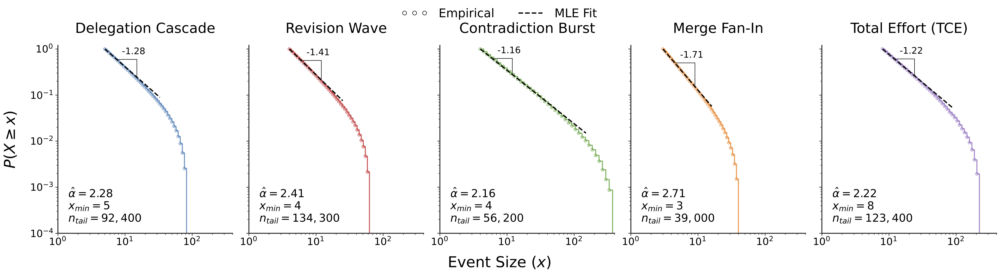

<div align="center">

# Do Agent Societies Develop Intellectual Elites? The Hidden Power Laws of Collective Cognition in LLM Multi-Agent Systems


## Overview

*We present the first large-scale empirical study of coordination dynamics in LLM-based multi-agent systems. Analyzing over 1.5 million coordination events across tasks, topologies, and agent scales, we uncover three coupled empirical laws governing collective reasoning, and introduce Deficit-Triggered Integration (DTI) as a law-aware intervention.*

</div>

---

<p align="center">
  
  <br/>
  <em>Heavy-tailed coordination cascades across all observables. CCDFs show a power-law regime (2 &lt; α̂ &lt; 3) with truncation at large x, consistent across tasks, topologies, and agent scales.</em>
</p>

---

## Abstract

Large Language Model (LLM) multi-agent systems are increasingly deployed as interacting agent societies, yet scaling these systems often yields diminishing or unstable returns, the causes of which remain poorly understood. We present the first large-scale empirical study of coordination dynamics in LLM-based multi-agent systems, introducing an atomic event-level formulation that reconstructs reasoning as cascades of coordination. Analyzing over **1.5 Million** interactions across tasks, topologies, and scales, we uncover *three coupled laws*: coordination follows heavy-tailed cascades, concentrates via preferential attachment into intellectual elites, and produces increasingly frequent extreme events as system size grows. We show that these effects are coupled through a single structural mechanism: an **integration bottleneck**, in which coordination expansion scales with system size while consolidation does not, producing large but weakly integrated reasoning processes. To test this mechanism, we introduce **Deficit-Triggered Integration (DTI)**, which selectively increases integration under imbalance. DTI improves performance precisely where coordination fails, without suppressing large-scale reasoning. Together, our results establish quantitative laws of collective cognition and identify coordination structure as a fundamental, previously unmeasured axis for understanding and improving scalable multi-agent intelligence.

---

## The Three Laws

<table>
<tr>
<td width="33%" valign="top">

### ❶ Heavy-Tailed Cascades

Coordination event sizes follow **truncated power-law distributions** with exponent α̂ ∈ (2, 3) across all observables, tasks, topologies, and model families. Most coordination trajectories remain local; a small fraction accumulates disproportionately large activity.

</td>
<td width="33%" valign="top">

### ❷ Intellectual Elites

Cognitive effort **concentrates endogenously** via preferential attachment. The top 10% of active agents account for >30% of all coordination effort at scale, and this gap widens systematically with N. Elite formation is a scale-amplified structural property, not a finite-size artifact.

</td>
<td width="33%" valign="top">

### ❸ Extreme-Event Scaling

The expected maximum cascade size grows as ⟨x_max⟩ ∝ N^γ, with γ̂_TCE ≈ 0.85 — closely matching the Extreme Value Theory prediction of γ_th ≈ 0.82. Larger societies produce **qualitatively larger** cascades, not merely more of them.

</td>
</tr>
</table>

These three laws are mechanistically coupled through an **integration bottleneck**: delegation and contradiction scale with agent count, while synthesis (merge) does not — producing large but weakly integrated reasoning trajectories that explain non-monotonic scaling failures in LLM MAS.

---

## Method

### Event-Based Coordination Formulation

We decompose multi-agent reasoning into five **atomic coordination primitives** extracted post-hoc from interaction traces. Agents are prompted only with task goals and topology constraints — event types are inferred from realized traces, not injected via prompt.

| Event | Definition | What It Captures |
|---|---|---|
| **Delegation Cascade** | Subtree size rooted at a `delegate_subtask` event | Recursive task decomposition and agent recruitment |
| **Revision Wave** | Length of a chain of `revise_claim` events | Iterative refinement of a claim |
| **Contradiction Burst** | Distinct agents issuing `contradict_claim` on the same parent | Parallel critique centered on one claim |
| **Merge Fan-In** | Number of parent claims referenced by a single `merge_claims` event | Information integration bottleneck |
| **Total Cognitive Effort (TCE)** | All downstream coordination events from a root claim | Aggregate cascade size |

The **claim DAG** is reconstructed from structured traces, with cascades extracted as root-centered reachable subgraphs. All observables are fully reproducible from logged interaction records.

### Reinforced Routing Theory

We model coordination as a routing process in which agents preferentially select claims that have accumulated prior engagement:

$$P(c_i \mid \mathcal{F}_t) = \frac{x_i(t)^\beta}{\sum_j x_j(t)^\beta}$$

where β > 0 controls reinforcement strength. This preferential attachment mechanism, bounded by finite system constraints, yields the observed truncated power-law distributions and predicts elite formation, extreme-event scaling, and the integration bottleneck as coupled consequences of a single micro-mechanism.

### Deficit-Triggered Integration (DTI)

DTI monitors the imbalance between expansion pressure and realized integration within each active cascade. When the integration deficit exceeds a condition-specific threshold:

$$\Delta_r(t_r) = P_r(t_r) - M_r > \delta_c$$

DTI temporarily prioritizes merge operations, consolidating active branch heads into a unified representation before resuming exploration. The intervention is **local, state-dependent, and cascade-level** — it does not alter agent capabilities or impose global constraints, and parameters are estimated from baseline coordination traces with no outcome-tuned quantities.

DTI **preserves the heavy-tailed cascade structure** while reducing excess tail mass and moderating elite concentration. Performance gains range from +2.07% (QA × Chain) to **+12.34%** (Planning × Mesh/FC), largest precisely where coordination imbalance is most pronounced.

---

## Results

### DTI Performance Gains (Δ task success over baseline)

|  | Planning | Reasoning | Coding | QA | Row Mean |
|---|---|---|---|---|---|
| **Mesh / FC** | +12.34% | +9.87% | +7.52% | +4.81% | 8.63% |
| **Star** | +11.23% | +9.14% | +6.89% | +5.12% | 8.10% |
| **Dynamic Rep.** | +8.76% | +9.43% | +6.21% | +3.94% | 7.08% |
| **Hierarchical** | +6.54% | +5.87% | +4.93% | +3.71% | 5.26% |
| **Chain** | +5.23% | +4.61% | +3.84% | +2.07% | 3.94% |
| **Col Mean** | **8.82%** | **7.78%** | **5.88%** | **3.93%** | |

### Key Quantitative Results

| Finding | Result |
|---|---|
| Power-law exponent range | α̂ ∈ (2, 3) across all observables, tasks, topologies, model families |
| Model preference (Vuong LRT) | Truncated power law over log-normal and pure power law (p < 0.05) |
| Top-10% effort share at N=512 | 30%+ of total coordination effort |
| Top-10% excess above egalitarian | +24pp at large N |
| TCE extreme-value scaling | γ̂ ≈ 0.85 vs. γ_th ≈ 0.82 |
| Preferential attachment fit | β̂ predicts S₁₀ with r = 0.97 across 168 conditions |
| Merge conversion ratio (N=512, top 1%) | 0.07 (vs. 0.21 at small N) |

---

## Experimental Setup

| Component | Configuration |
|---|---|
| **Benchmarks** | GAIA, SWE-bench Verified, REALM-Bench, MultiAgentBench |
| **Task types** | QA, reasoning, coding, planning |
| **Agent counts** | {8, 16, 32, 64, 128, 256, 512} |
| **Topologies** | Chain, Star, Tree, Hierarchical, Fully Connected, Sparse Mesh, Dynamic Reputation |
| **Model families** | GPT-4o-mini, Qwen 2.5 72B, Llama 3.1 70B, Qwen 2.5 7B |
| **Total runs** | ~98,000 (400 tasks × 7 scales × 7 topologies × 5 seeds) |
| **Total events** | >1.5 million coordination events |
| **Execution** | LangGraph; shared LLM, prompt, tools, and task instances per run |
| **Statistical framework** | Clauset–Shalizi–Newman MLE; Vuong likelihood-ratio tests; KS goodness-of-fit |

---

## Repository Structure

```
mas-elites/
├── claim-traces/                  # Raw per-run coordination event traces
│   └── {benchmark}/
│       └── {topology}/
│           └── {n_agents}/
│               └── {seed}/
│                   ├── events.jsonl        # Timestamped coordination events
│                   ├── snapshots.jsonl     # Agent state snapshots
│                   ├── run_config.json     # Run configuration
│                   ├── run_metadata.json   # Runtime metadata
│                   └── swe_prediction.json # Task prediction output
├── images/                        # Figures for README and paper
├── src/
│   ├── agents/                    # Agent base classes and LLM/peer agent implementations
│   │   ├── base_agent.py
│   │   ├── llm_agent.py
│   │   └── peer_agent.py
│   ├── analysis/                  # End-to-end analysis pipeline
│   │   └── run_pipeline.py
│   ├── benchmark_wrappers/        # GAIA, SWE-bench, REALM-Bench, MultiAgentBench loaders
│   │   ├── gaia.py
│   │   ├── swebench.py
│   │   ├── realm_bench.py
│   │   ├── marble.py
│   │   ├── task_expander.py       # Benchmark-conditioned workload expansion
│   │   └── task_curator.py
│   ├── dti/                       # Deficit-Triggered Integration implementation
│   │   └── dti.py
│   ├── event_extraction/          # Post-hoc event extractor and claim DAG builder
│   │   ├── event_extractor.py
│   │   ├── graph_builder.py
│   │   ├── coordination.py
│   │   └── tce.py
│   ├── execution/                 # LangGraph runner and MAS execution state
│   │   ├── runner.py
│   │   ├── graph_runner.py
│   │   └── mas_state.py
│   ├── loggers/                   # Trace logging schemas and event bus
│   │   ├── event_bus.py
│   │   ├── schemas.py
│   │   ├── state.py
│   │   └── trace_schema.py
│   ├── metrics/                   # Gini, Lorenz, and inequality metrics
│   │   └── inequality.py
│   ├── observables/               # Cascade metrics, TCE, DAG construction
│   │   ├── cascade_metrics.py
│   │   └── dag_builder.py
│   ├── prompts/                   # Base prompt, topology/task addenda, response parser
│   │   ├── base_prompt.py
│   │   ├── topology_addenda.py
│   │   ├── task_addenda.py
│   │   ├── action_contract.py
│   │   ├── response_parser.py
│   │   ├── topology/              # Per-topology prompt fragments
│   │   └── tast_family/           # Per-task-family prompt fragments
│   ├── tables/                    # Table generation for paper
│   │   └── generate_tables.py
│   ├── tail_fitting/              # Power-law MLE fitting (Clauset-Shalizi-Newman)
│   │   └── powerlaw_fit.py
│   ├── tools/                     # Agent tool definitions and web search
│   │   └── tools.py
│   ├── topologies/                # Topology graph implementations
│   │   ├── base.py
│   │   ├── chain.py
│   │   ├── star.py
│   │   ├── tree.py
│   │   ├── full_mesh.py
│   │   ├── sparse_mesh.py
│   │   ├── dynamic_reputation.py
│   │   ├── hybrid.py
│   │   └── modular.py
│   ├── visualization/             # Figure generation scripts
│   │   ├── ccdf_panel.py          # Fig 1, 3: CCDF plots
│   │   ├── ccdf_by_family.py
│   │   ├── lorenz_curves.py       # Fig 4: Elite concentration curves
│   │   ├── xmax_scaling.py        # Fig 7: Extreme-value scaling
│   │   ├── event_vs_success.py    # Fig 6: Coordination vs. task success
│   │   ├── topology_comparison.py
│   │   └── lr_test_heatmap.py
│   └── context_builder.py         # Agent context assembly
├── .env                           # API keys (not tracked)
├── LICENSE
├── requirements.txt
└── README.md
```

---

## Installation & Setup

Clone the repository:
```bash
git clone https://anonymous.4open.science/r/mas-elites-0645/
```

Install dependencies:
```bash
conda create -n mas-elites python=3.11 -y
conda activate mas-elites
pip install -r requirements.txt
```

Add your OpenAI API key:
```bash
export OPENAI_API_KEY=your_key_here
```

---

## Running Experiments

Verify the sweep plan without executing:
```bash
python scripts/run_sweep.py --dry-run
```

Small-scale smoke test:
```bash
python scripts/run_sweep.py \
    --benchmarks gaia \
    --topologies chain star \
    --scales 8 16 \
    --seeds 0 1
```

Full sweep:
```bash
python scripts/run_sweep.py --workers 4
```

The sweep script supports `--resume` (skips completed runs), parallel workers, live progress tracking with ETA, and per-run error logging.

---

## Data

Raw coordination event traces are included in `claim-traces/` and organized as:

```
claim-traces/{benchmark}/{topology}/n{agents}/s{seed}/{task_id}/
    events.jsonl        # Timestamped coordination event log
    snapshots.jsonl     # Per-step agent state snapshots
    run_config.json     # Topology, scale, and task configuration
    run_metadata.json   # Timing and completion metadata
    swe_prediction.json # Final task prediction
```

Full processed data and analysis outputs will be released via HuggingFace upon paper acceptance.

---

## Citation

```bibtex
@article{anonymous2026agent,
  title     = {Do Agent Societies Develop Intellectual Elites?
               The Hidden Power Laws of Collective Cognition in LLM Multi-Agent Systems},
  author    = {Anonymous},
  journal   = {arXiv preprint arXiv:0000.12345},
  year      = {2026}
}
```

---

## License

This project is licensed under the Apache 2.0 License. See [LICENSE](LICENSE) for details.
